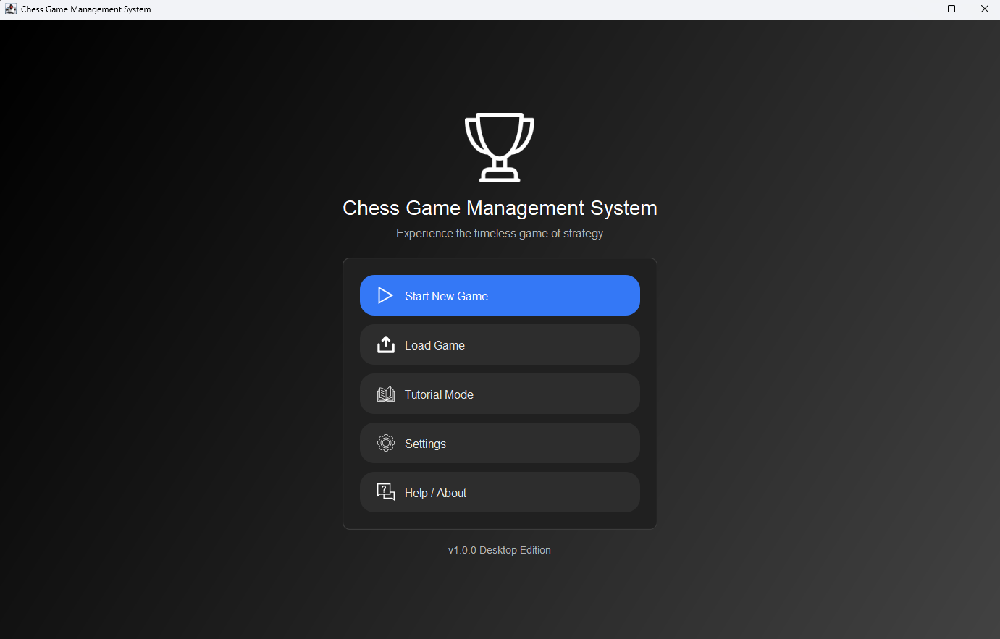
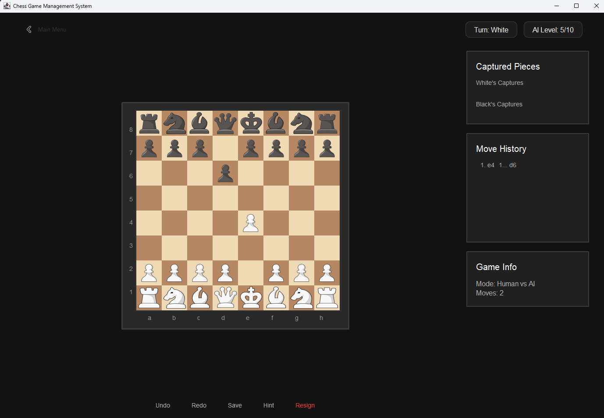
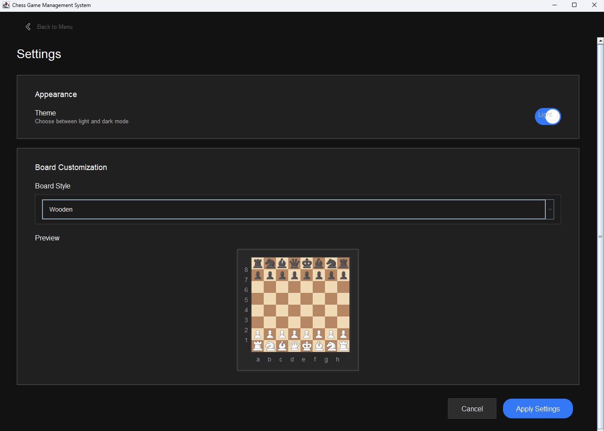
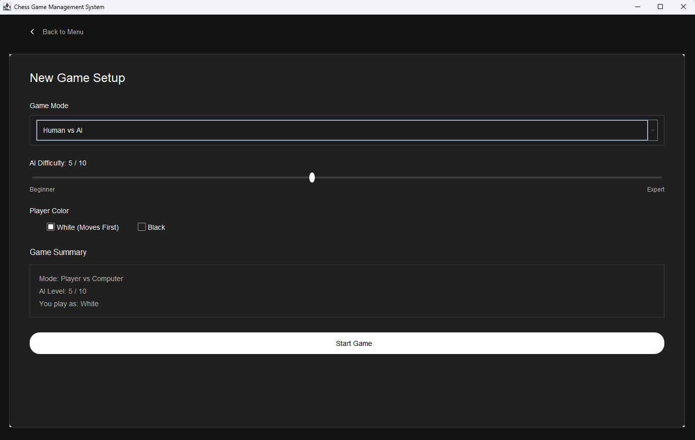
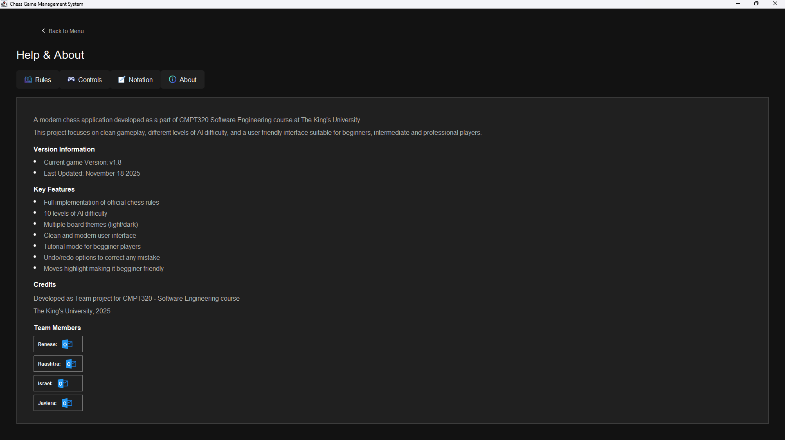
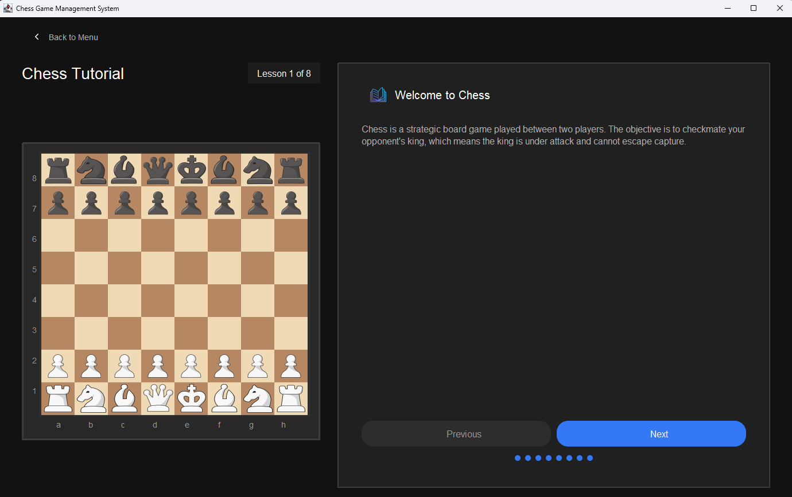

# ♟️ Chess Game

## Project Overview

A classic Chess game with Modern UI and interactive gameplay!

## Key Features

- Clean and modern graphical user interface with responsive performance.
- Supports multiple screen resolutions and customizable board themes.
- Highlights valid moves and displays algebraic notation.
- Built-in AI with multiple difficulty levels.
- AI vs AI, Human vs AI, and Human vs Human game modes.
- Smooth switching between game modes without restarting.
- Save and load games using Portable Game Notation (PGN).
- Navigate move history with undo and redo functionality.
- Interactive tutorial mode with rules, piece movement, and strategies.
- Hint system to assist beginner players.
- In-game help menu accessible during play.
- About section with version and credits information.

---
## 📱 App Screens

<p align="center">
  
  
</p>

<p align="center">
  
  
</p>

<p align="center">
  
  
</p>

---

# 🚀 Get Started

## Compile (Needs Apache Ant)
To compile and run the project:

```
ant compile
ant run
```

## Testing (JUnit)
To test the model and generate a testing report run:

```
ant test
```

Then navigate to `report/html/index.html` with a web browser. 

```
open report/html/index.html
```

## Build a Distributable (JAR file)
To build an executable jar file, run:

```
ant jar
```

## Cleaning
To clean created files from building, navigate to the root of this repository and run:

```
ant clean
```
